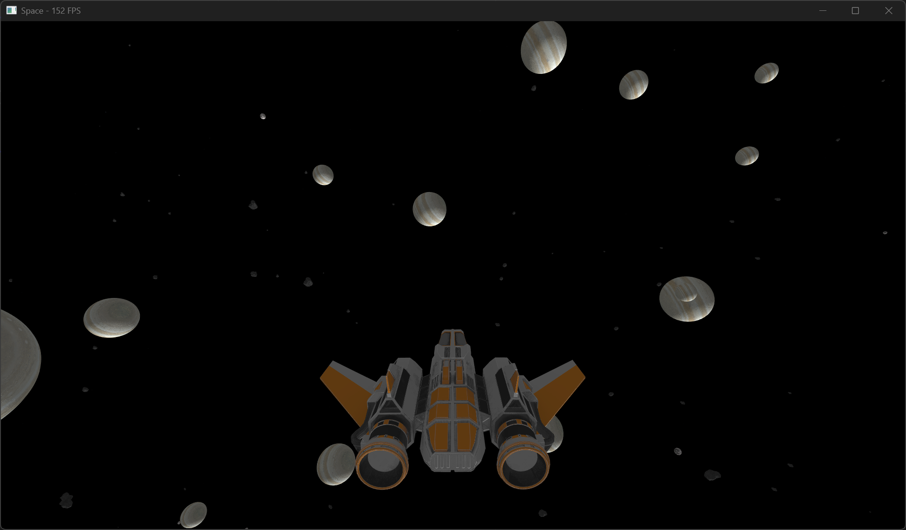

# Space

A game built on the foundations of Norse mythology-inspired C++ libraries.

## Overview

Space is a game development project that combines powerful architectural patterns and modern C++ frameworks to deliver high-performance, scalable game applications. Built on top of Freya's graphics framework, it utilizes Freyr's multithreaded Entity-Component-System (ECS) architecture for game logic and Skirnir's IoC Container for dependency injection and service management.

## Dependencies

Space relies on the following key dependencies:

- **[Freyr](https://github.com/gilmar-sales/Freyr)** - A multithreaded ECS library with focus on parallelism based on task queues by archetype chunks. Provides data-oriented entity management, dynamic runtime behavior, and parallel processing capabilities for game entities and systems.

- **[Freya](https://github.com/gilmar-sales/Freya)** - An open-source framework providing comprehensive tools for graphics and game development. Serves as the rendering and graphics foundation for the project.

- **[Skirnir](https://github.com/gilmar-sales/Skirnir)** - An IoC Container using C++ Type Loophole for automatic dependency injection. Manages service lifetimes (Transient, Scoped, Singleton) and provides built-in logging capabilities with the fmt library.

## Features

### From Freyr (ECS)
- **Data-Oriented Design** - Optimized memory layout for cache-friendly performance
- **Multithreaded Processing** - Parallel system execution for maximum CPU utilization
- **Dynamic Behavior** - Runtime entity composition without recompilation
- **Event System** - Observer pattern for inter-system communication

### From Freya (Graphics)
- Comprehensive graphics and rendering framework
- Game development utilities and tools
- Visual rendering pipeline

### From Skirnir (DI & IoC)
- **Service Lifetime Management** - Transient, Scoped, and Singleton lifetimes
- **Automatic Dependency Injection** - Constructor parameter resolution using C++ Type Loophole
- **Built-in Logging** - Integrated logging with fmt library for all services
- **Type-Safe Service Resolution** - Compile-time service registration and resolution
